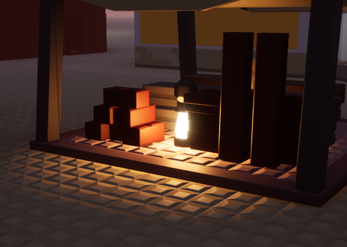
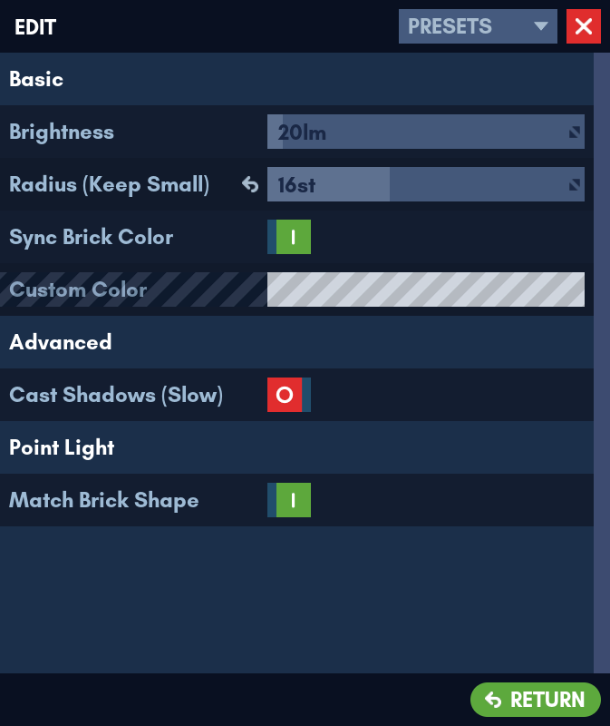
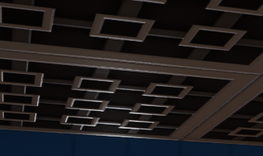
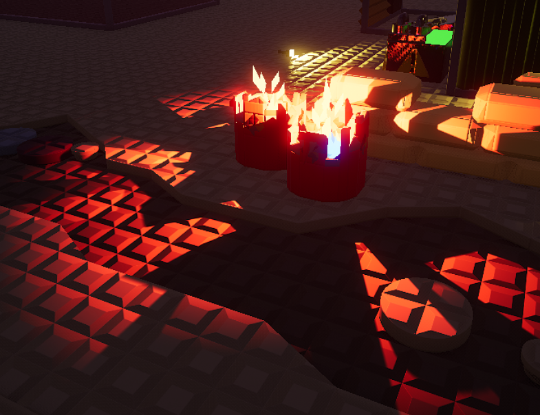

# Point Light

This component adds a point light to a brick.

## Tips for this Component

- You can use small radius point lights to light up signs, glowing crystals, neon lights, etc.
- Point lights without shadows can cause undesired light leaks. It is advisable to turn down the *light radius* when this happens.

- Do not overlap point lights too much as this can cause performance issues.
- Point light shadows are very intensive and can impact performance massively in large amounts, so use them carefully.
- It is important to use the *Cast Shadows* option sparsely or when it's necessary. Misuse of this can lead to your point lights casting abnormal shadows like this.

