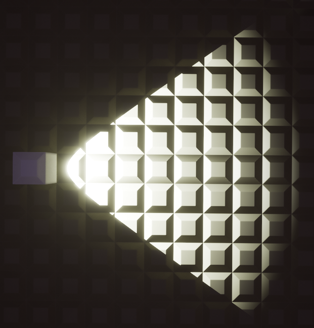

# Spot Light

This component adds a spotlight to a brick.

## Tips for this Component

- Spot lights rotate with the placer's ghost preview, so their *Rotation* settings aren't affected in any way.
- Do not overlap spot lights too much as this can cause performance issues.
- If the *Inner Cone Angle* is higher than the *Outer Cone Angle*, the spotlight will produce a result like this:
  