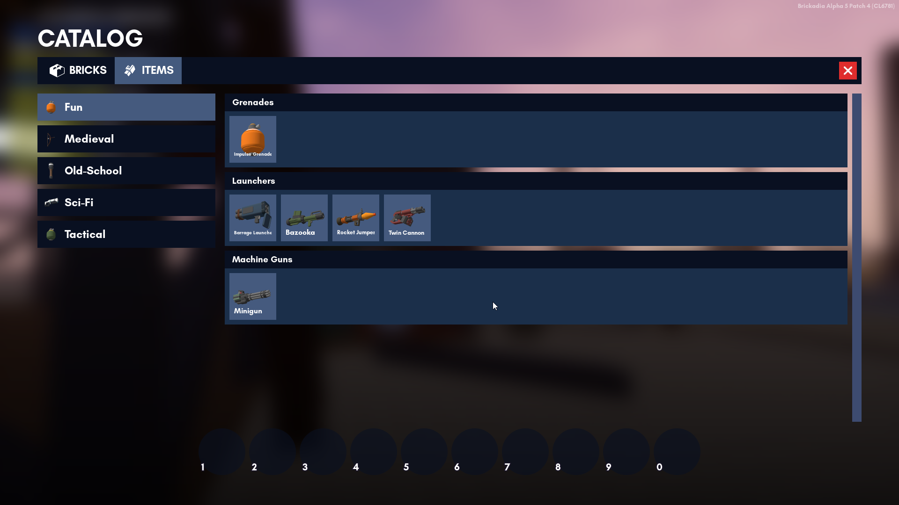

# Catalog

The catalog is where you can grab your bricks and weapons from. It is a user interface for getting items.

Currently, you are able to browse:
1. [Bricks]()
2. [Weapons]()

## Browsing the Catalog

To access the Catalog, simply press **B**. You can switch between bricks and weapons on the top bar.

To get an item from the Catalog, simply click one of the items you want. This will put it in the [Quickbar](quickbar.md).

To remove items from your Quickbar, right click on them.