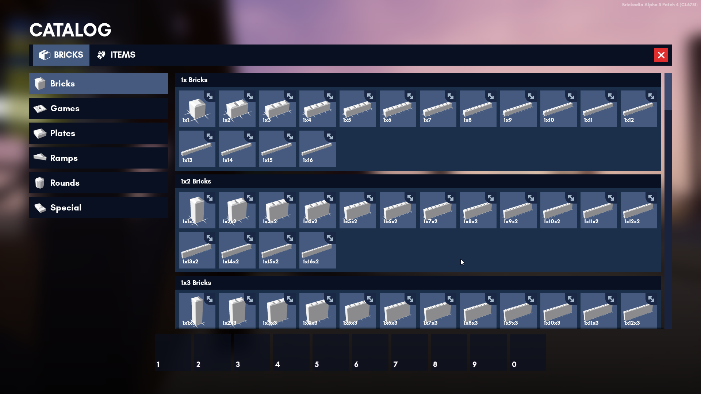
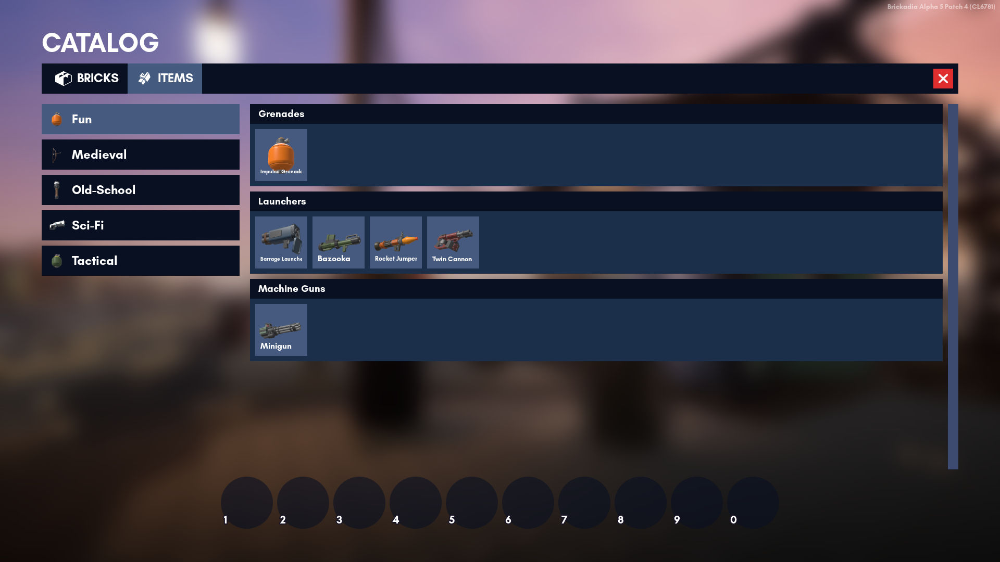

# Catalog

The catalog is where you can grab your bricks and weapons from. It is a user interface for getting items.

Currently, you are able to browse:
1. [Bricks]()
2. [Weapons]()

## Browsing the Catalog

To access the Catalog, simply press **B**. You can switch between bricks and weapons on the top bar.

To get an item from the Catalog, simply click one of the items you want *or* click and drag the item to the [Quickbar](quickbar.md). This will put it in the Quickbar.

To remove items from your Quickbar, right click on them *or* click and drag the item back to the Catalog.

To add a brick to the Quickbar as a **temporary brick**, middle click the brick you want in the Catalog. **This exits the Catalog.**