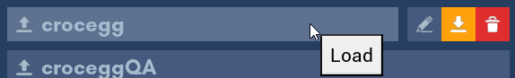

# Presets

In Brickadia, presets are everywhere.

Presets can be saved as:
- Avatars
- Palettes
- Environment configurations
- Graphics settings

**This list is not exhaustive.**

## Presets Menu

The Presets menu is accessible at any given point when it's possible to save configurations as presets.

Click any preset to load it.

When you hover over a preset in this menu, 3 options will show.

Here's a list of the options (in order):
1. Rename - Click this button to rename the preset.
2. Overwrite - Click this yellow button to overwrite the preset with your current configuration.
3. Delete - Click this red button to remove the preset. A prompt that lets you confirm the deletion will appear.