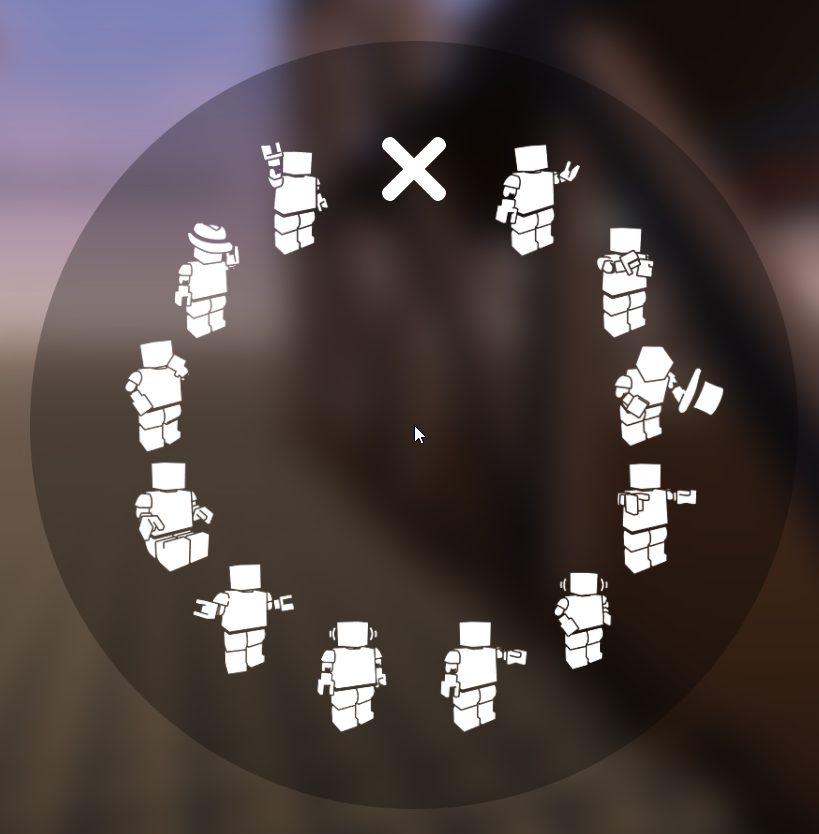

# Radial Menus

There are two radial menus in the game.

## Radial Emote Menu

To use an emote, hold the **H** key to open the menu and hover over the emote you want. From there, release the **H** key.

To stop using an emote (hugging and sitting), hover over the X icon.

## Radial Tool Menu

To equip a tool, hold the **G** key to open the menu and hover over the tool you want. From there, release the **G** key.

## Default Keybindings

|Action|Keybinding|Functionality|
|---|---|---|
|Hold to Emote|H|Opens the radial Emote menu.|
|Open Tool Pie Menu|G|Opens the radial Tool menu.|